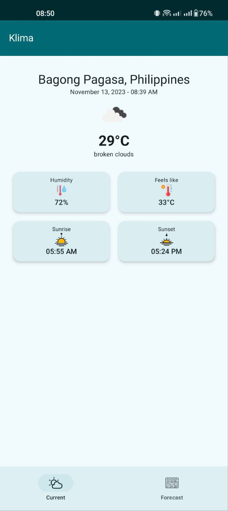

# Klima

Klima is a weather application using [OpenWeather Weather API](https://openweathermap.org/api).

# UI

 


# Build
Create a `keystore.properties` file in the root of your project and add your own OpenWeather API Key using this variable

```
openWeatherApikey="<API_KEY>"
```